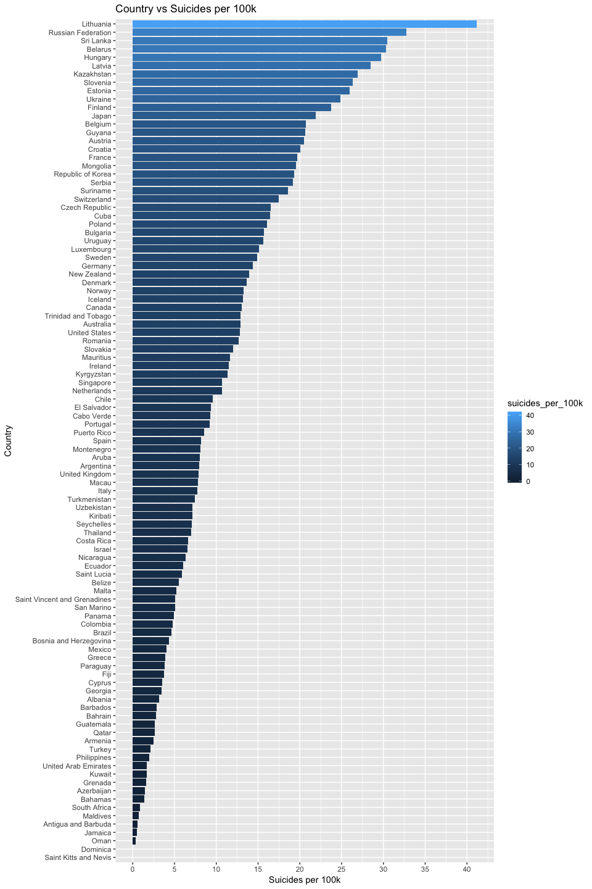
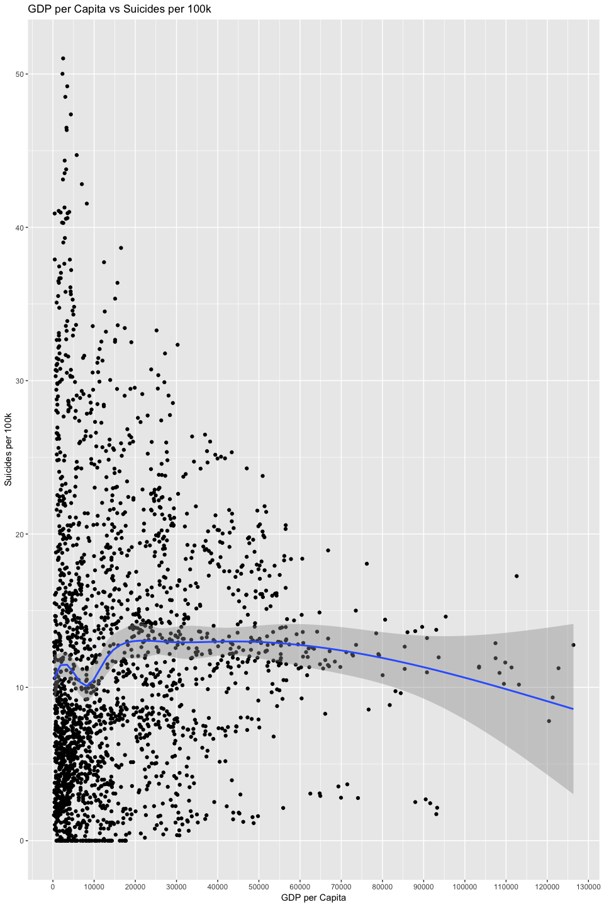
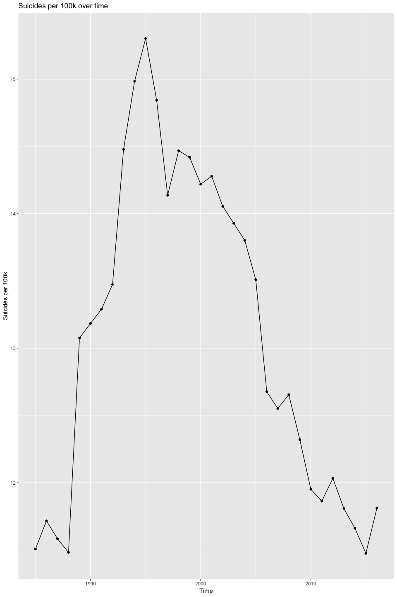
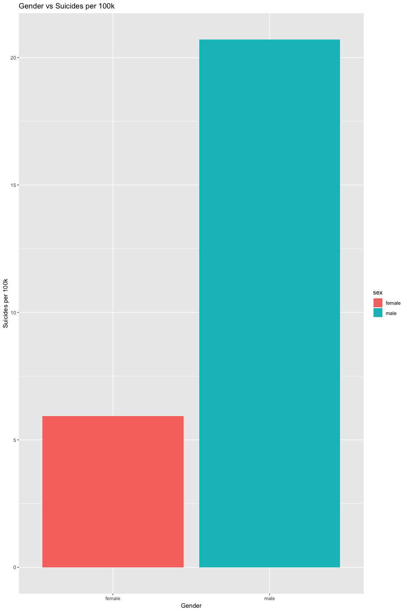
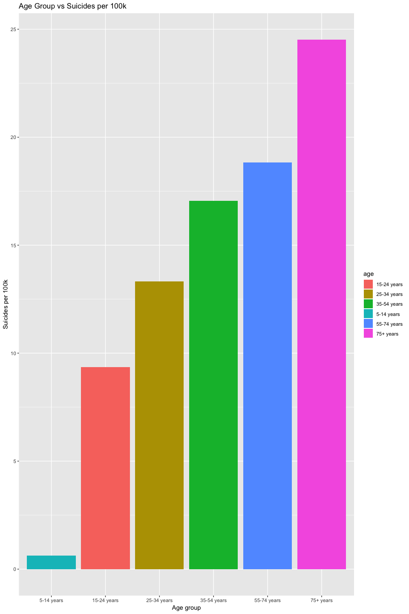
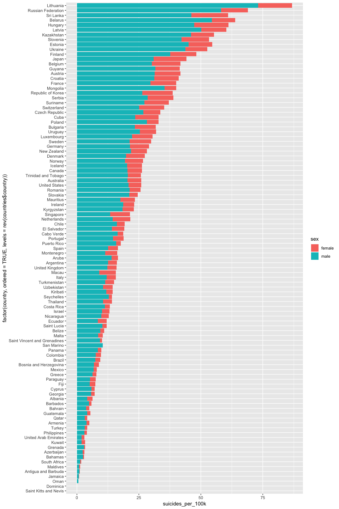
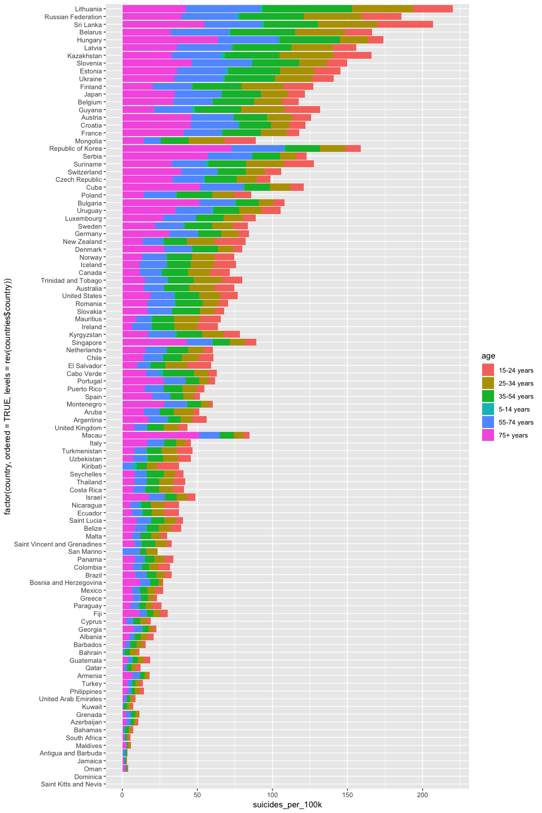

Here, we read the csv file we want to use and make a dataframe for it.

    df <- read.csv("master.csv")

    df <- df %>%
      mutate(gdp_per_capita = gdp_per_capita....)

    countries <- df %>%
      group_by(country) %>%
      summarize(suicides = sum(as.numeric(suicides_no)), population = sum(as.numeric(population)), suicides_per_100k = 100000 * (suicides/population)) %>%
      arrange(desc(suicides_per_100k))

    gdp <- df %>%
      group_by(gdp_per_capita) %>%
      summarize(suicides = sum(as.numeric(suicides_no)), population = sum(as.numeric(population)), suicides_per_100k = 100000 * (suicides/population))

    time_df <- df %>%
      group_by(year) %>%
      summarize(population = sum(as.numeric(population)), suicides = sum(as.numeric(suicides_no)), suicides_per_100k = 100000* (suicides/population))

    sex <- df %>%
      group_by(sex) %>%
      summarize(population = sum(as.numeric(population)), suicides = sum(as.numeric(suicides_no)), suicides_per_100k = 100000*(suicides/population))

    head(df)

    ##   country year    sex         age suicides_no population suicides.100k.pop
    ## 1 Albania 1987   male 15-24 years          21     312900              6.71
    ## 2 Albania 1987   male 35-54 years          16     308000              5.19
    ## 3 Albania 1987 female 15-24 years          14     289700              4.83
    ## 4 Albania 1987   male   75+ years           1      21800              4.59
    ## 5 Albania 1987   male 25-34 years           9     274300              3.28
    ## 6 Albania 1987 female   75+ years           1      35600              2.81
    ##   country.year HDI.for.year gdp_for_year.... gdp_per_capita....
    ## 1  Albania1987           NA    2,156,624,900                796
    ## 2  Albania1987           NA    2,156,624,900                796
    ## 3  Albania1987           NA    2,156,624,900                796
    ## 4  Albania1987           NA    2,156,624,900                796
    ## 5  Albania1987           NA    2,156,624,900                796
    ## 6  Albania1987           NA    2,156,624,900                796
    ##        generation gdp_per_capita
    ## 1    Generation X            796
    ## 2          Silent            796
    ## 3    Generation X            796
    ## 4 G.I. Generation            796
    ## 5         Boomers            796
    ## 6 G.I. Generation            796

    age_group <- df %>%
      group_by(age) %>%
      summarize(population = sum(as.numeric(population)), suicides = sum(as.numeric(suicides_no)), suicides_per_100k = 100000*(suicides/population))

    head(countries) 

    ## # A tibble: 6 x 4
    ##   country            suicides population suicides_per_100k
    ##   <fct>                 <dbl>      <dbl>             <dbl>
    ## 1 Lithuania             28039   68085210              41.2
    ## 2 Russian Federation  1209742 3690802620              32.8
    ## 3 Sri Lanka             55641  182525626              30.5
    ## 4 Belarus               59892  197372292              30.3
    ## 5 Hungary               73891  248644256              29.7
    ## 6 Latvia                12770   44852640              28.5

    head(gdp)

    ## # A tibble: 6 x 4
    ##   gdp_per_capita suicides population suicides_per_100k
    ##            <int>    <dbl>      <dbl>             <dbl>
    ## 1            251       47    2822500              1.67
    ## 2            291      556    4298100             12.9 
    ## 3            313      510    4369202             11.7 
    ## 4            345      560    4425784             12.7 
    ## 5            357      106    3366600              3.15
    ## 6            359      567    4473163             12.7

    head(time_df)

    ## # A tibble: 6 x 4
    ##    year population suicides suicides_per_100k
    ##   <int>      <dbl>    <dbl>             <dbl>
    ## 1  1985 1008600086   116063              11.5
    ## 2  1986 1029909613   120670              11.7
    ## 3  1987 1095029726   126842              11.6
    ## 4  1988 1054094424   121026              11.5
    ## 5  1989 1225514347   160244              13.1
    ## 6  1990 1466620100   193361              13.2

    head(sex)

    ## # A tibble: 2 x 4
    ##   sex     population suicides suicides_per_100k
    ##   <fct>        <dbl>    <dbl>             <dbl>
    ## 1 female 26272781857  1559510              5.94
    ## 2 male   25049376579  5188910             20.7

    head(age_group)

    ## # A tibble: 6 x 4
    ##   age          population suicides suicides_per_100k
    ##   <fct>             <dbl>    <dbl>             <dbl>
    ## 1 15-24 years  8642946896   808542             9.35 
    ## 2 25-34 years  8438103587  1123912            13.3  
    ## 3 35-54 years 14375888123  2452141            17.1  
    ## 4 5-14 years   8398693237    52264             0.622
    ## 5 55-74 years  8803245340  1658443            18.8  
    ## 6 75+ years    2663281253   653118            24.5

    countries_plot <- countries %>%
      ggplot(aes(x = factor(country, ordered=TRUE, levels=rev(countries$country)), y = suicides_per_100k, fill=suicides_per_100k)) +
      geom_bar(stat="identity") + 
      coord_flip() +
      scale_y_continuous(breaks=seq(0,45,5)) +
      labs(title = "Country vs Suicides per 100k", x = "Country", y = "Suicides per 100k")

    gdp_plot <- gdp %>%
      ggplot(aes(x = gdp_per_capita, y = suicides_per_100k)) +
      geom_point() +
      geom_smooth() +
      scale_x_continuous(breaks=seq(0,200000,10000)) +
      labs(title = "GDP per Capita vs Suicides per 100k", x = "GDP per Capita", y = "Suicides per 100k")
    time_plot <- time_df %>%
      ggplot(aes(x = year, y = suicides_per_100k)) +
      geom_point() +
      geom_line() +
      labs(title = "Suicides per 100k over time", x = "Time", y = "Suicides per 100k")

    sex_plot <- sex %>%
      ggplot(aes(x = sex, y = suicides_per_100k, fill=sex)) +
      geom_bar(stat="identity") +
      labs(title = "Gender vs Suicides per 100k", x = "Gender", y = "Suicides per 100k")

    age_group_plot <- age_group %>%
      ggplot(aes(x = factor(age, ordered=TRUE, levels=c("5-14 years","15-24 years","25-34 years","35-54 years","55-74 years","75+ years")), y= suicides_per_100k, fill=age)) +
      geom_bar(stat="identity") +
      labs(title = "Age Group vs Suicides per 100k", x = "Age group", y = "Suicides per 100k")

    countries_plot

    gdp_plot

    ## `geom_smooth()` using method = 'gam' and formula 'y ~ s(x, bs = "cs")'

    time_plot

    sex_plot

    age_group_plot

    sex_country <- df %>%
      group_by(country, sex) %>%
      summarize(population = sum(as.numeric(population)), suicides = sum(as.numeric(suicides_no)), suicides_per_100k = 100000 * (suicides/population)) %>%
      arrange(desc(suicides))

    sex_country

    ## # A tibble: 202 x 5
    ## # Groups:   country [101]
    ##    country            sex    population suicides suicides_per_100k
    ##    <fct>              <fct>       <dbl>    <dbl>             <dbl>
    ##  1 Russian Federation male   1710091647   995412             58.2 
    ##  2 United States      male   3940328915   820216             20.8 
    ##  3 Japan              male   1796237345   555272             30.9 
    ##  4 Ukraine            male    591598875   258573             43.7 
    ##  5 Japan              female 1884787499   251630             13.4 
    ##  6 France             male    808977854   239708             29.6 
    ##  7 Russian Federation female 1980710973   214330             10.8 
    ##  8 United States      female 4113698286   213797              5.20
    ##  9 Germany            male    986239175   211555             21.5 
    ## 10 Republic of Korea  male    677995723   179115             26.4 
    ## # … with 192 more rows

    sex_country %>%
      ggplot(aes(x = factor(country, ordered=TRUE, levels=rev(countries$country)), y = suicides_per_100k, fill = sex)) +
      geom_bar(stat = "Identity") +
      coord_flip()

    age_country <- df %>%
      group_by(country, age) %>%
      summarize(population = sum(as.numeric(population)), suicides = sum(as.numeric(suicides_no)), suicides_per_100k = 100000 * (suicides/population)) %>%
      arrange(desc(suicides))

    age_country %>%
      ggplot(aes(x = factor(country, ordered=TRUE, levels=rev(countries$country)), y = suicides_per_100k, fill = age)) +
      geom_bar(stat="Identity") +
      coord_flip()

